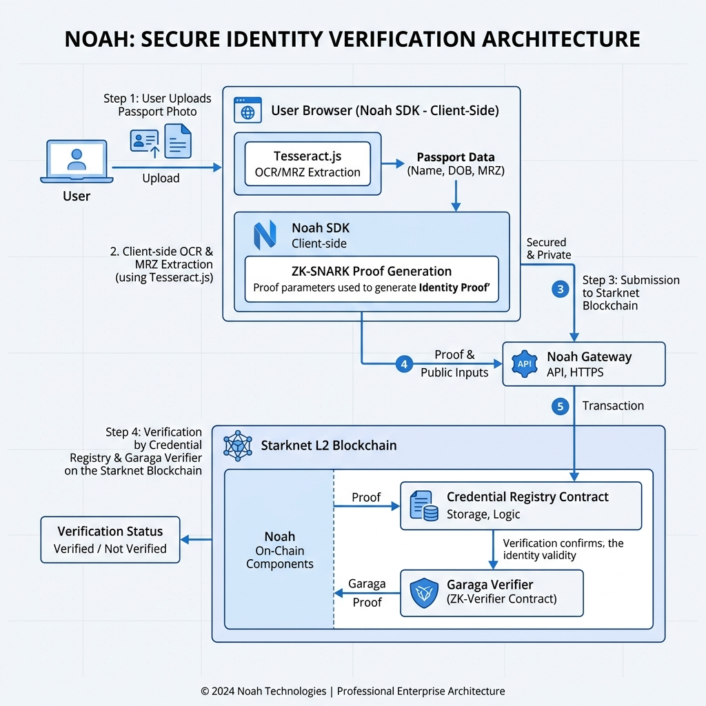
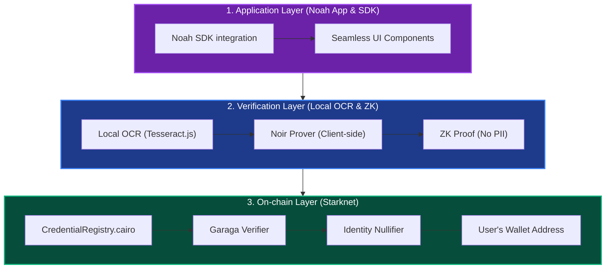
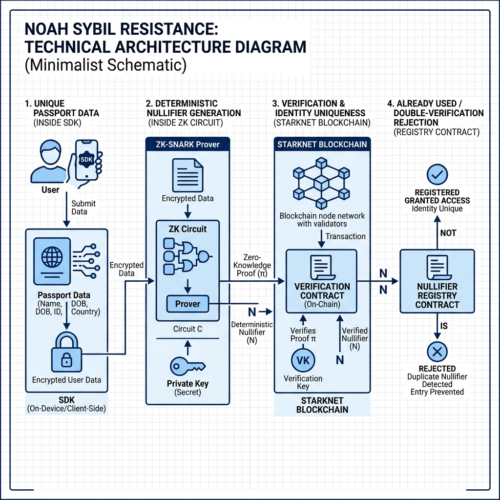

# NOAH:Privacy-Preserving KYC for Starknet 🛡️⚓

**NOAH** (Network for On-chain Authenticated Handshakes) is a state-of-the-art, zero-knowledge proof-based identity protocol for the Starknet ecosystem. It enables decentralized applications—from Gaming and DeFi to Consumer Apps—to verify user credentials  without ever touching or storing personal data.

## The Noah Vision: "Verify Once, Use Everywhere"
Noah eliminates the redundancy of KYC on-chain. By using Zero-Knowledge Proofs (ZKP), users bind their identity to their wallet address once. This verification is then instantly reusable across every integrated app on Starknet, while maintaining 100% user privacy.

---

## 🌟 Use Cases
Here is what you can build with Noah:

### 1. Gaming & Web3 E-Sports
Keep your leaderboards fair. Verify that each player is a unique human, putting an end to multi-accounting and bot farms without revealing the player's real-world identity.

### 2. Consumer Applications
Age-gate your content or services effortlessly. Prove your user is over 18 without asking them to upload a photo of their ID card to your servers.

### 3. DeFi & RWA Platforms
Onboard users securely. Meet strict compliance requirements while preserving your users' on-chain privacy.

---

## 🏗️ Technical Structure & Architecture
The Noah Protocol is structured into three integrated layers that prioritize user privacy and on-chain security:

### 1. Application Layer (Noah App & SDK)
Developers integrate the **Noah SDK** into their dApps. The SDK provides a seamless UI that handles user interaction—from passport photo upload to proof generation—without requiring complex back-end configuration.

### 2. Verification Layer (Client-Side OCR & ZK)
All sensitive processing occurs locally on the user's device. The SDK uses **Tesseract.js** for browser-side OCR to extract document data (MRZ), which is then passed to a **Noir-based Prover**. The prover generates a Zero-Knowledge Proof (ZKP) that confirms identity attributes without exposing any Personally Identifiable Information (PII).

### 3. On-chain Layer (Starknet)
The ZK Proof is submitted to the **CredentialRegistry** on Starknet. The registry uses a **Garaga-optimized Verifier** to cryptographically validate the proof. Once verified, a unique identity nullifier is permanently bound to the user's wallet address.





---

## 🛡️ Sybil Resistance & Privacy
### Unique Identity Binding
Noah ensures **Sybil Resistance** without a central database. By deriving a deterministic **Nullifier** (Hash of the Passport Number) inside the ZK circuit, the protocol ensures that each physical passport can only be used once across the entire network.

### Zero-Data Architecture
- **No Backend**: No central server ever sees or processes the user's passport data.
- **Client-Side Proving**: Proofs are generated via WASM in a secure environment on the user's device.
- **Selective Disclosure**: Proves only the *requirement* (e.g., "User is over 18"), not the raw *data*.



---

## 🚀 Deployment Status

### Starknet Sepolia
- **CredentialRegistry**: [0x00107bca4ea84b0d540a44454a94ebf10e4b0181da34eb8b4c3eea134605730b](https://sepolia.starkscan.co/contract/0x00107bca4ea84b0d540a44454a94ebf10e4b0181da34eb8b4c3eea134605730b)

### Starknet Mainnet
- **CredentialRegistry**: `[PLACEHOLDER]`

---

## 🛠️ Getting Started

### Prerequisites
- **Node.js (v20+)**
- **Scarb** & **Starknet Foundry** (for contract development)
- **Noir** (for circuit development)

### 1. Setup the SDK
```bash
cd sdk
npm install
npm run build
```

### 2. Launch the App
```bash
cd ../app
npm install
npm run dev
```

### 3. Test Contracts
```bash
cd ../contracts
snforge test
```

---

**Repository**: [Samuel1-ona/Noah-Starknet](https://github.com/Samuel1-ona/Noah-Starknet)  
**Status**: Devnet/Sepolia Active  
**Powered by**: Starknet, Noir, Garaga.
