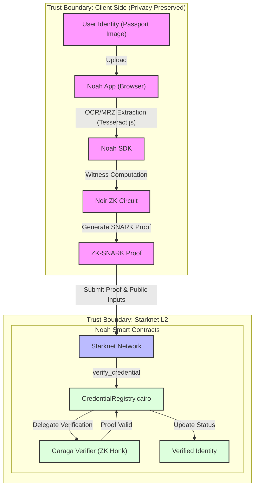

# Noah Technical Architecture

Detailed breakdown of the Noah ecosystem, illustrating the flow from user passport upload to on-chain verification.

## Professional Architecture Overview (OCR Flow)

## Architecture Diagram (Schematic)

## Key Components

### 1. Noah App (`/app`)
*   **Purpose**: User interface for identity verification.
*   **Features**: NFC scanning, Progress tracking for proof generation, Wallet integration (Argent X / Braavos).

### 2. Noah SDK (`/sdk`)
*   **Purpose**: Core logic for interacting with the Noah ecosystem.
*   **Responsibilities**:
    *   Cryptographic operations (using `@aztec/bb.js`).
    *   Contract communication via `starknet.js`.
    *   Role-based access control (Issuer Manager).

### 3. Smart Contracts (`/contracts`)
*   **CredentialRegistry**: Manages the verification lifecycle, prevents double-use of passports via nullifiers, and handles administrative roles.
*   **Verifier**: A highly optimized Cairo contract generated by Garaga to verify BN254 ZK proofs on-chain.

## Verification Flow

1.  **Scan**: The user scans their passport using NFC. The app extracts the MRZ (Machine Readable Zone) data locally.
2.  **Prove**: The Noir circuit generates a ZK proof that the passport is valid and satisfies specific criteria (e.g., age > 18) without revealing the MRZ data.
3.  **Relay**: The proof is submitted via the SDK to the `CredentialRegistry` contract.
4.  **Verify**: The contract calls the Garaga verifier. If valid, the user's address is marked as "Verified" and a nullifier is stored to prevent re-using the same passport for a different address.
