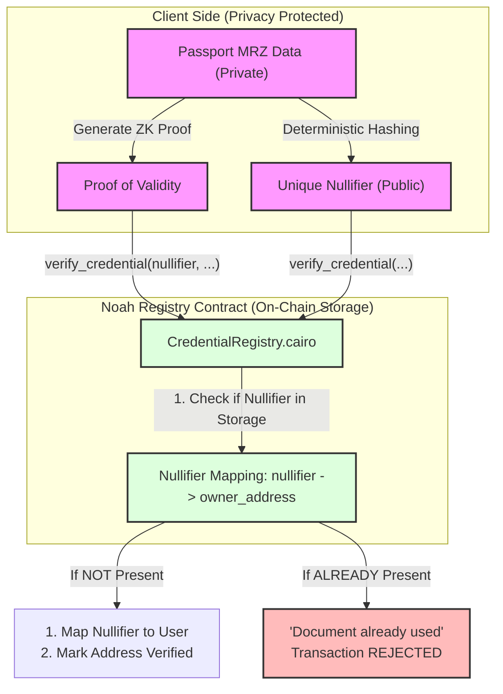

# Sybil Resistance via ZK Nullifiers

Noah ensures that each physical passport can only be used to verify one unique account on Starknet, preventing Sybil attacks while maintaining absolute user privacy.

## Professional Sybil Resistance Overview

## Sybil Resistance Architecture

## How It Works

### 1. The ZK Nullifier
The **Nullifier** is a deterministic hash of the passport’s unique identifiers (like the Passport Number) calculated strictly inside the ZK circuit. Because it's deterministic, the same passport always results in the same nullifier. Because it's a hash, the actual passport number is never revealed on-chain.

### 2. Double-Verification Prevention
When a user attempts to verify their account, the `CredentialRegistry` check for the submitted nullifier:
*   **Unique Use**: If the nullifier hasn't been seen before, the registry links it to the user's Starknet address and grants "Verified" status.
*   **Sybil Protection**: If the same nullifier is submitted again (even from a different Starknet address), the registry rejects the transaction because the "Document" has already been used.

### 3. Trustless Integrity
This system provides **Sybil Resistance** without requiring a central authority to track who has verified. The math (ZK) and the state (Starknet) work together to enforce uniqueness trustlessly.
